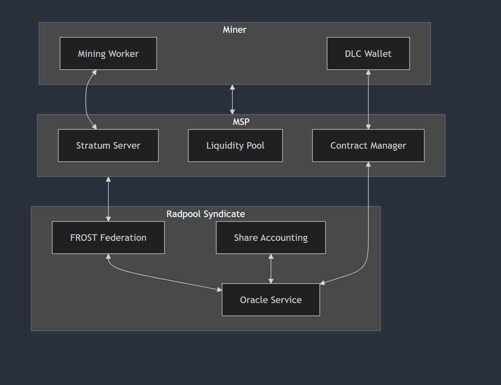
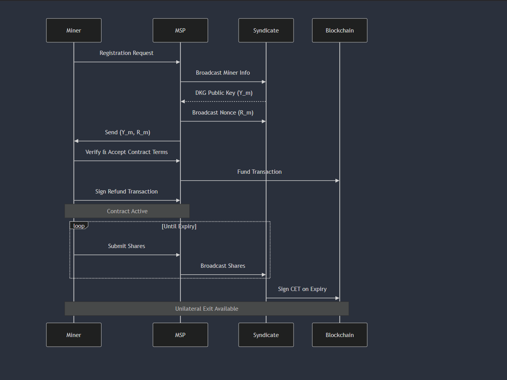
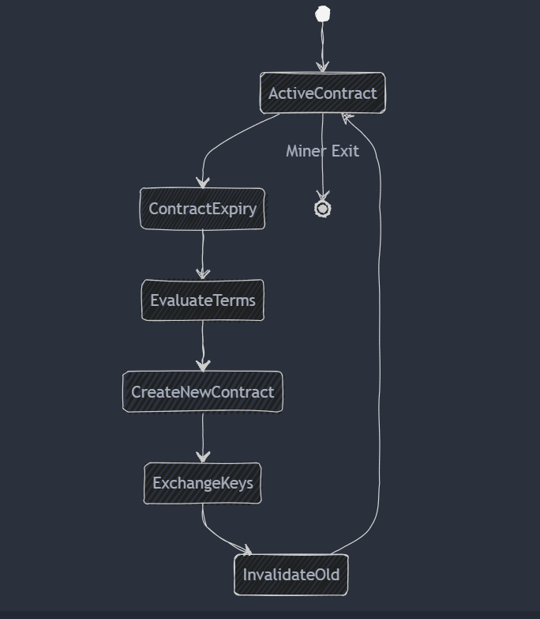
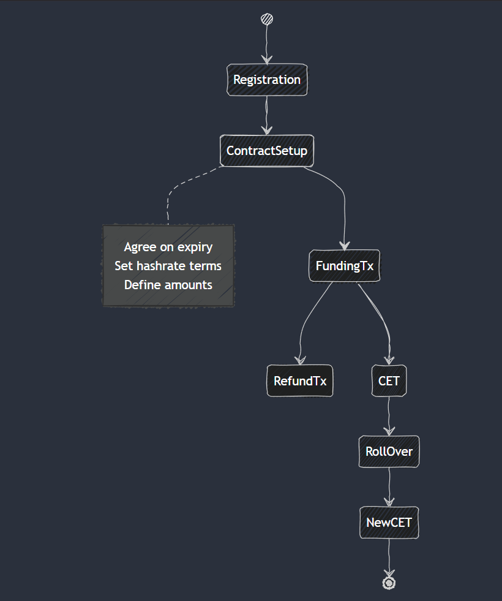

# Technical Specification: DLC Contract Implementation for Radpool Payouts

Version: 1.0.0

Status: Draft

---

## Table of Contents

1. [Overview](#1-overview)
    - [1.1 Purpose](#11-purpose)
    - [1.2 Scope](#12-scope)
    - [1.3 Prerequisites](#13-prerequisites)
2. [System Architecture](#2-system-architecture)
3. High-Level Design
4. Component Overview
6. Network Topology
7. System Boundaries and Interfaces

## 1. Overview
### 1.1 Purpose
This specification defines the implementation details for Discrete Log Contracts (DLCs) between miners and Mining Service Providers (MSPs) in Radpol, where a federation of MSPs acts as an oracle using FROST threshold signatures.

### 1.2 Scope

- Syndicate Lifecycle
- DLC contract creation and settlement between miners and MSPs
- Taproot script structures
- Optimisations
- Transaction flow and state transitions

### 1.3 Prerequisites
Refer to [RADPOOL PROTOCOL SPEC](https://www.radpool.xyz/1/index.html)

## 2. System Architecture
### 2.1 Components and Responsibilities

#### 2.1.1 Miner Node Architecture

1. DLC Wallet Service
    - Protocol: Custom P2P
    - Port: 8331
    - Dependencies: Bitcoin Core, Lightning Network (optional)

- Handle miner registration protocol
- Execute unilateral exits upon contract expiration
- Manage pubkey tweaking with oracle signatures
- Process Contract Execution Transactions (CETs)
- Validate and verify DLC contract terms
- Monitor contract states and expirations

    
2. Stratum Mining Interface with Radpool Wrapper
    - Protocol: Stratum V2
    - Port: 3333
    - Dependencies: None

- Execute mining operations using provided block templates
- Interface with stratum protocol for mining communications
- Process mining.notify messages from MSPs
- Submit shares via mining.submit to designated MSP
- Validate received block templates
- Maintain connection with assigned MSP

#### 2.1.2 Mining Service Provider (MSP) Component

1. Liquidity Manager
    - Manage liquidity pools for miner payouts
    - Monitor and maintain collateral requirements
    - Handle DLC contract funding

2. Stratum Service Wrapper
    - Process incoming connections from miners
    - Handle mining.notify and mining.submit messages
    - Validate submitted shares
    - Maintain miner session states

3. Syndicate Client
    - Participate in FROST federation
    - Coordinate with other MSPs (broadcast miner shares)
    - Handle oracle operations

4. Contract Manager
    - Handle DLC lifecycle management
    - Process contract registrations
    - Monitor contract expirations
    - Execute contract settlements

5. Blockchain Client
    - Generate block templates
    - Monitor blockchain state
    - Handle chain reorganizations
    - Validate blocks and transactions

#### 2.1.3 Radpool Syndicate Component

1. Federation Management
    - Coordinate FROST operations
    - Manage membership
    - Handle consensus protocols
    - Handle coinbase Spend
    - Maintain syndicate membership

2. Oracle Service
    - Sign DLC contracts
    - Validate contract conditions
    - Provide oracle attestations

3. Data Replication Service
    - Maintain consistent state across MSPs
    - Handle share distribution
    - Manage block template propagation

## 3. Implementation Details

### 3.1 Sequence Diagram

### 3.2 Miner <-> MSP DLC lifecycle

### 3.3 DLC flow chart

### 3.4 Components

## 4. Network Topology
4.1 Core Network Structure
   - Fully Connected MSP Syndicate Network
     * Each MSP maintains direct P2P connections with all other MSPs
     * Minimum N MSPs required for network operation (N ≥ 3f + 1, f = max faulty nodes)
     * Byzantine Fault Tolerant (BFT) broadcast channel between all nodes
     * Authenticated and encrypted communication channels (ECDH)

   4.2 Network Layers
   - Syndicate Layer
     * Primary network for MSP-to-MSP communication
     * Reliable BFT broadcast for share replication
     * FROST Federation protocol communication
     * DLC oracle signature coordination
   
   - Mining Service Layer
     * Stratum protocol interface for miners
     * WebSocket connections for miner dashboards
     * Connection pooling for miner management
     * Load balancing across MSP nodes

## 5. System Boundaries and Interfaces

5.1 External Interfaces
   - Miner Interfaces
     * Stratum V1/V2 protocol endpoints
     * WebSocket API for real-time updates
     * REST API for miner registration and management
     * Dashboard interface for monitoring
   
   - Bitcoin Network Interface
     * Block template construction
     * Transaction mempool interface
     * Block submission interface
     * Network state monitoring

5.2 Internal Interfaces
   - MSP-to-MSP Protocol
     * Point-to-point encrypted channels
     * Share broadcast protocol
     * Consensus messaging protocol
     * DKG protocol messages
     * TSS protocol messages
   
   - Data Storage Interfaces
     * Share database interface
     * State management interface
     * Contract storage interface
     * Miner performance metrics

5.3 Security Boundaries
   - Authentication boundaries
     * MSP identity verification
     * Miner authentication
     * Share ownership verification

   - Authorization boundaries
     * MSP permission management
     * Miner access control

## 6. System Constraints

6.1 Operational Constraints
   - Network Requirements
     * Maximum latency between MSPs: 200ms
     * Minimum bandwidth: 100 Mbps
   
   - Performance Constraints
     * Maximum share processing delay: 100ms
     * single DKG round under 800 ms (including network latency)

6.2 Protocol Constraints
   - Consensus Requirements
     * Minimum 60% hashrate participation for membership
     * 2/3 MSP agreement for oracle signatures
   
   - Security Constraints
     * Maximum tolerated Byzantine nodes: f where N ≥ 3f + 1
     * Minimum key refresh interval: 144 blocks
     * Maximum contract rollover period: 100 blocks

6.3 Resource Constraints
   - MSP Requirements
     * Minimum capital lock requirement: 5x margin
     * Minimum storage capacity: 1TB
   
   - Scaling Constraints
     * Maximum supported miners per MSP: 10,000
     * Maximum concurrent DLC contracts: 50,000
     * Maximum syndicate size: 50 MSPs
